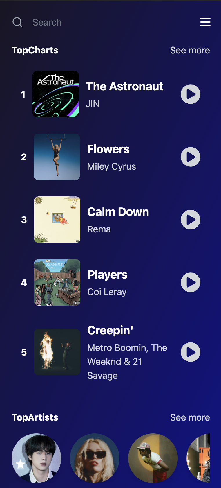
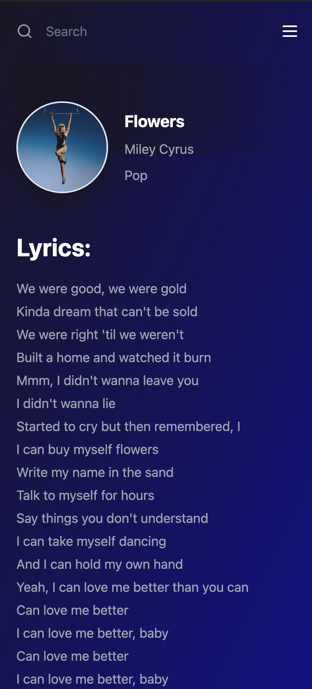
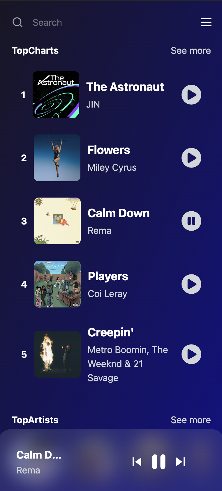

# Lyriks 

#### Lyriks is a Spotify clone music app built using React, Redux, Vite, Tailwind and the Shazam API.

Use the app [here](https://lyriks-shazam-app.netlify.app/)

## Client Side:
The UI was built using **React**, **Vite** and **Tailwind**.

## REST API:
The REST API endpoints are provided by the Shazam API.

# Description
**Lyriks** is a fully responsive Spotify clone music app built with **React**, **Tailwind** and **Vite** which uses **Redux** for the state management. The app features a fully functional music player which allows the user to listen to their selected songs. On accessing the app, the user is provided with the top charts based on their country location. The app also allows the user to search for songs by title, artist and genre as well as being able to access the lyrics for a selected song. 

 
# Take a Look at the App

## Desktop:

<kbd>

</kbd>

## Mobile:

<kbd>

</kbd>

<kbd>

</kbd>

<kbd>

</kbd>

# Tools Used

### Development Environment
* Node.js

### Libraries & Frameworks
* React 
* Redux
* Vite
* Tailwind 

### Hosting Frontend
* Netlify

### REST API
* Rapid API marketplace
* Shazam API

# Features

### Users are able to:

* see the current top charts 
* see the current top charts based on their location
* see the current top artists
* see the lyrics of their favourite songs
* see related songs
* search for songs by genre
* search for songs by title
* search for songs by artist
* use the music player to listen to their selected songs

</body>
